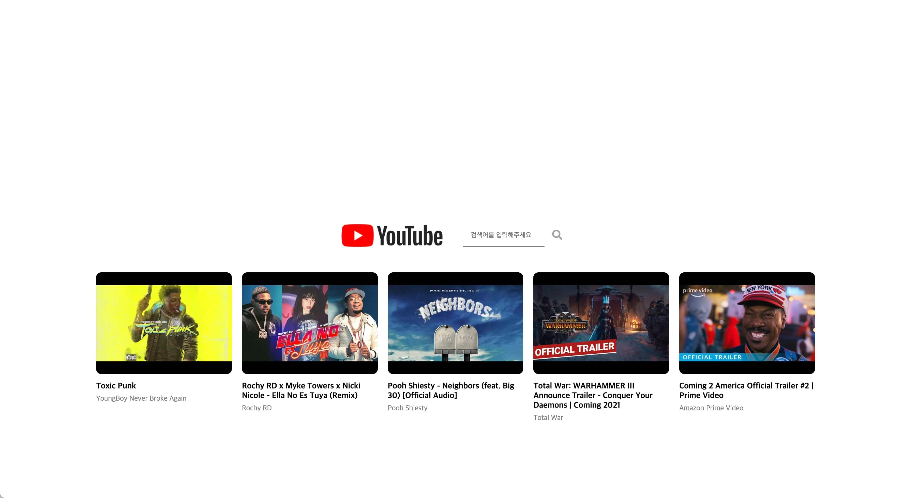
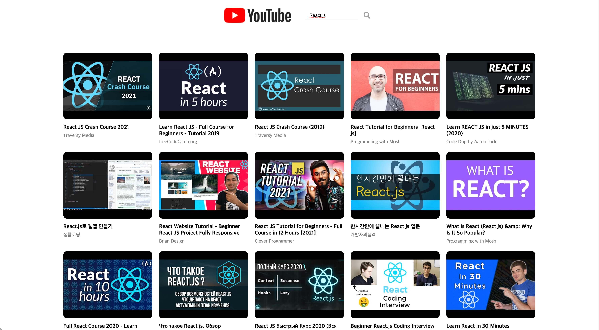
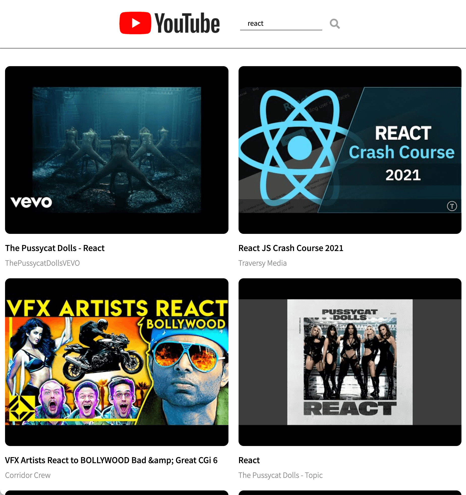
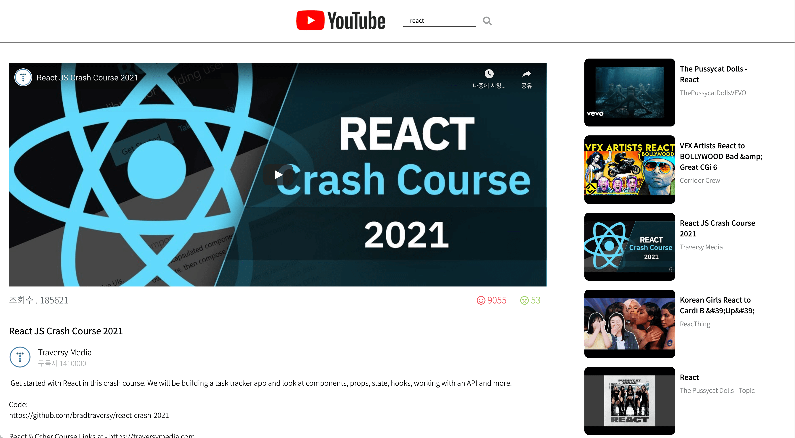

# React_Youtube
YouTube Data API v3를 활용하여 개인 유튜브 웹사이트를 제작하였습니다.           
 

## 사용 언어
 - HTML, CSS, PostCSS, JavaScript, React

### PostCSS
PostCSS를 사용한 이유는 크로스 브라우징이 용이하고       
현재 많은 개발자들이 PostCSS를 활용하여 프로젝트를 진행하기 때문입니다.        
사용하고자 하는 jsx 파일 상단에 아래의 코드를 추가합니다.        

    import styles from './경로'

그 후 className="" 을 사용하는 것 대신 className={style.클래스 이름} 을 사용합니다.          

### 네트워크 통신 코드 - axios
fetch를 사용하게 되면 반복되는 url이 반복되고 예전 브라우저에서는 호환이 안될 때가 있습니다.        
또한 일일이 json 파일로 변환해 줘야 합니다. 하지만 axios 를 사용하면 이러한 것들을         
편리하게 해결해 주기 때문에 사용을 합니다. 또한 긴 url로 가독성이 떨어졌던 fetch 에 비하여
params로 나누기 때문에 가독성이 좋습니다.
 
공통적으로 쓰이는 url과 params를 상위에 쓰고 아래 코드와 같이     
사용하고자 하는 코드들을 더 추가하여 작성합니다.  

youtube.js

    constructor(key){
        this.youtube = axios.create({
            baseURL: "https://youtube.googleapis.com/youtube/v3",
            params: {key: key},
        });
    }

    async mostPopular(){
        const response = await this.youtube.get('videos', {
            params: {
                part: 'snippet',
                chart: 'mostPopular',
                maxResults: 5,
            }
        })
        return response.data.items;
    }

### 네트워크 통신 코드 - fetch

네트워크 통신에 사용하는 코드들을 분리하여 새로운 class로 만들었습니다.          
먼저 constructor로 키값을 받아오고 중복돼서 사용되는 getRequestOptions를 만들었습니다.         

youtube_fetch.js

    constructor(key){
        this.key=key;
        this.getRequestOptions = {
            method: 'GET',
            redirect: 'follow'
        };
    }

두 가지 api가 사용되기 때문에 두 개의 함수를 제작 후 리턴해주었습니다.        
url 주소에서 받아온 데이터를 json 파일로 변환하고 items들을 리턴해주었습니다.        
(검색하였을 때 id 값이 두 개가 있는 것을 확인하였고 하나만 사용하기 위하여 map을 사용하였습니다.)         
Postman을 이용하여 api들을 관리하고 저장하였습니다.        

youtube_fetch.js

    async mostPopular(){
        const response = await fetch("https://youtube.googleapis.com/youtube/v3/videos?part=snippet&chart=mostPopular&maxResults=5&key=" + this.key, this.getRequestOptions);
        const result = await response.json();
        return result.items;
    }

    async search(query){
        const response = await fetch("https://youtube.googleapis.com/youtube/v3/search?part=snippet&maxResults=25&q=" + query + "&type=video&key=" + this.key, this.getRequestOptions);
        const result = await response.json();
        return result.items.map(item => ({ ...item, id: item.id.videoId }));
    }

그 후 index.js에서 youtube.js 파일을 가져와 사용하였습니다.        

index.js 
    
    const youtube = new Youtube(process.env.REACT_APP_YOUYUBE_API);

제 키를 깃허브에 노출시키면 많은 사람들이 보기에 .env 파일을 만들고 따로 저장 후        
.gitignore을 통하여 업로드를 막았습니다.       

.gitignore

    #API Keys
    .env

## 웹사이트 구성
메인 페이지와 검색 결과 페이지 두 개를 제작하였습니다.          
React Router를 사용하여 페이지 간 이동을 하였습니다.        

메인페이지     

메인페이지 반응형

검색페이지      

검색페이지 반응형

비디오 재생 화면

비디오 재생 화면 반응형

### Main Page - Form
화면 중앙에는 유튜브 로고 검색창을 두었고 아래에는     
유튜브에서 가장 인기 있는 영상 5개를 가져와 보여주었습니다.      

검색 값을 받아오기 위하여 searchValue를 만들었고        
onChange에 setSearchValue를 넣어 타이핑 시 값이 계속 바뀌도록 하였습니다.           

onSubmit 시에는 form의 특성상 새로 고침되는 것을 방지하기 위하여      
e.preventDefault(); 를 사용하였습니다.         
props.searchWord(searchValue);를 사용하여 사용자가 입력한 값을      
부모 요소로 전달하였습니다.      

mainSearchForm.jsx

    const [searchValue, setSearchValue] = useState("");

    const onSubmit = e =>{
        e.preventDefault();
        props.searchWord(searchValue);
        document.querySelector('#searchLink').click();
    }

    return(
        <section className={styles.wrap}>
            

            <form action="#" onSubmit={onSubmit} className={styles.searchForm}>
                <input
                type="text"
                placeholder="검색어를 입력해주세요"
                className={styles.searchText}
                value = {searchValue}
                onChange = {e =>setSearchValue(e.target.value)}
                />
                <button type="submit" className={styles.searchButton}><i className="fas fa-search"></i></button>
                <NavLink id="searchLink" className={styles.searchLink} to="/searchPage">Link</NavLink>
            </form>
        </section>
    );

### Main Page - Video List
useEffect를 사용하여 창이 로드가 되면 props로 받아온 youtube를 사용하여 
배열을 새로 받아온 후 setMostVideos에 넣었습니다.
이렇게 받아온 데이터를 props로 MostVideoList 한테 전달하였습니다.       

app.jsx

    useEffect(() =>{
        youtube
        .mostPopular()
        .then(videos => setMostVideos(videos));
    }, [])
    .
    .
    .
    <Route path="/">
        

            <MainSearchForm searchWord={searchWord}/>
            <MostVideoList videos={mostVideos}/>
        

    </Route>

app.jsx에서 데이터를 받아온 most_video_list.jsx에서는         
map을 사용하여 MostVideoItem를 제작하였습니다.         

most_video_list.jsx

    return(
        

            <ul className={styles.listContainer}>
                {props.videos.map(video => <MostVideoItem key={video.id} video={video}/>)}
            </ul>
        

    );

most_video_list.jsx에서 데이터를 받아온 most_video_item.jsx에서는      
필요한 정보를 수집하여 li 요소를 리턴하였습니다. 

most_video_item.jsx

    return(
        <li className={styles.videoList}>
            
            <h2 className={styles.title}>{snippet.title}</h2>
            {snippet.channelTitle}
        </li>
    );

### Search Page - Header
헤더에는 유튜브 로고와 검색창을 배치하였습니다.       
로고를 클릭 시 React Router를 활용하여 메인 페이지로 이동하게 하였습니다.        

메인 페이지에서 검색 데이터를 받은 app.jsx에서는 해당 단어는 SubSearchForm으로 전달하고,        
그 단어를 youtube class에 넣어 setSearchVideos 를 업데이트 시켰습니다.

app.jsx

    const searchWord = word =>{
        setWord(word);
    }

    useEffect(()=>{
        if(word == "")return;
        youtube
        .search(word)
        .then(videos => setSearchVideos(videos));
    },[word])
    .
    .
    .
    <Route path="/searchPage">
        

            <SubSearchForm searchWord={word} newSearchWord={searchWord} />
            <SearchVideoList videos={searchVideos} />
        

    </Route>

app.jsx에서 데이터를 받아온 subSearchForm.jsx에서는        
검색창에 사용자가 입력했던 검색어를 그대로 넣어놔        
어떤 것을 검색했었는지 알 수 있게 하였습니다.       
다시 검색을 할 경우 메인 페이지에서 검색을 하였던 것과 마찬가지로 app.jsx에       
값을 보내어 영상들이 바뀌도록 하였습니다.       

subSearchForm.jsx

    const onSubmit = e =>{
        e.preventDefault();
        props.newSearchWord(searchValue);
    }

    useEffect(()=>{
        setSearchValue(props.searchWord);
    },[])

    return(
        <header className={styles.header}>
            <NavLink to='/' className={styles.logo}></NavLink>
            <form action="#" onSubmit={onSubmit} className={styles.searchForm}>
                <input
                type="text"
                placeholder="검색어를 입력해주세요"
                className={styles.searchText}
                value = {searchValue}
                onChange = {e =>setSearchValue(e.target.value)}
                />
                <button type="submit" className={styles.searchButton}><i className="fas fa-search"></i></button>
            </form>
        </header>
    );

### Search Page - Video List

메인 페이지와 동일한 형식으로 제작하였습니다.        
search_video_list.jsx에서 map을 활용하여 SearchVideoItem을 제작하였습니다.        

search_video_list.jsx

    return(
        <ul className={styles.listWrap}>
            {props.videos.map(video => <SearchVideoItem key={video.id} video={video} />)}
        </ul>
    )

search_video_list.jsx에서 데이터를 받아온 search_video_item.jsx에서는        
필요한 정보를 수집하여 li 요소를 리턴하였습니다. 

search_video_item.jsx

    return(
        <li className={styles.videoList}>
            
            <h2 className={styles.title}>{snippet.title}</h2>
            {snippet.channelTitle}
        </li>
    )

송재혁입니다.      
감사합니다.